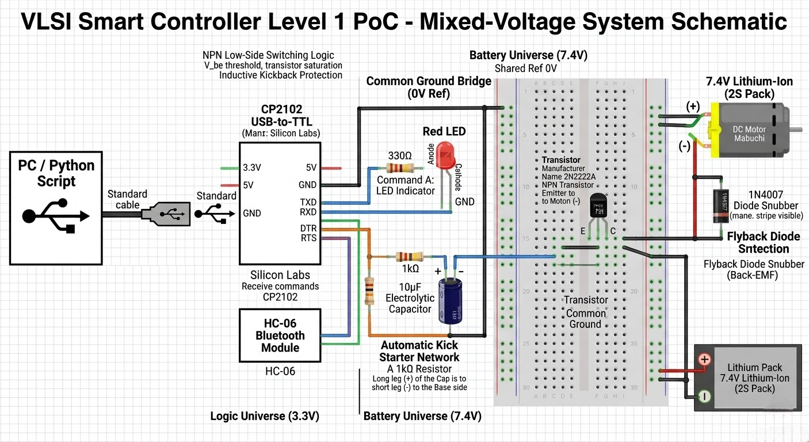

# **VLSI Smart Home Controller \- Level 1 Proof of Concept (PoC)**

This repository represents the practical implementation phase of my academic course in **Very Large Scale Integration (VLSI)**. It serves as a Level 1 PoC, bridging the gap between discrete logic control and high-power physical systems.

## **🎓 Academic Context**

As part of my VLSI studies, this project explores the interfacing of low-voltage CMOS-level logic (from a host PC) with high-current power electronics. While VLSI focuses on the integration of millions of transistors, this level starts with the fundamental unit: the single NPN transistor switch, understood as a building block for larger integrated systems.  
**Roadmap:** This repo will be updated as the course progresses, transitioning from discrete components to integrated circuits and complex logic arrays.

## **🛠 Project Description**

Smart home automation systems can be implemented using a wide variety of communication protocols depending on the range, power consumption, and data requirements, including **Bluetooth, Wi-Fi, Zigbee, and Z-Wave**.  
This specific project is a hybrid-voltage control system that utilizes the **Bluetooth** protocol to allow a laptop (via Python) to independently control a low-power LED indicator and a high-power 7.4V DC Motor.

### **Key Features:**

* **Mixed-Voltage Logic:** 3.3V Logic and 7.4V Power sharing a Common Ground.  
* **Software Interface:** Python-based logic managed and executed via **VS Code**.  
* **Hardware Interfacing:** Utilization of **USB-to-TTL drivers** (CP210x) to map signals through the laptop's **COM ports**.  
* **Wireless Control:** Integrated Bluetooth (HC-06) for remote triggering via the **Bluetooth Serial Terminal** mobile app.

## **⚡ System Schematic & Wiring BluePrint**

The following diagram illustrates the complete hardware integration. It highlights the use of protection components (Flyback Diode) and torque enhancements (Kick-start Capacitor) within our mixed-voltage architecture.

### **📐 Technical Specifications**
| Component | Function | Value/Spec | 
| :--- | :--- | :--- | 
| **Transistor** | Low-Side Switch (NPN) | 2N2222A | 
| **Diode** | Flyback Protection (Snubber) | 1N4007 | 
| **Capacitor** | Speed-up "Kick" (Stiction Fix) | 10µF | 
| **Logic Source** | USB-to-TTL Bridge | CP2102 (3.3V) | 
| **Power Source** | Lithium-Ion Battery | 7.4V (2S) | 
| **Resistors** | Current Limiting | 1kΩ (Base), 330Ω (LED) |

### **🔌 Official Wiring Table**

| From Component | Pin/Leg | To Component | Connection Type |
| :--- | :--- | :--- | :--- |
| **CP2102** | DTR | LED (+) | Signal Path (LED) |
| **LED (-)** | Cathode | GND Rail | Return Path |
| **CP2102** | RTS | 1kΩ Resistor | Control Path (Motor) |
| **1kΩ Resistor** | (Output) | Transistor Base | Trigger Signal |
| **10µF Cap** | Parallel | Across 1kΩ Resistor | Kick-start Impulse |
| **Battery (+)** | 7.4V Rail | Motor (+) | High Power Path |
| **Diode (1N4007)** | Stripe | Battery (+) | Protection (Clamp) |
| **Motor (-)** | Output | Transistor Collector | Return to Switch |
| **Transistor** | Emitter | GND Rail | System Common Ground |

## **🔬 Theoretical Concepts Applied**

### **1\. UART Protocol & Serial Control**

The system utilizes the Universal Asynchronous Receiver-Transmitter (UART) protocol. Instead of standard TX/RX data pins, we repurpose the **DTR (Data Terminal Ready)** and **RTS (Request to Send)** hardware flow control pins of the CP2102 as manual logic toggles.

### **2\. Low-Side Switching (NPN Logic)**

The 2N2222A transistor is placed on the **Negative (Low) side** of the load.

* **Why?** In an NPN configuration, the Emitter is tied to Ground (0V). This allows a small 3.3V signal from the laptop to easily exceed the V\_{be} threshold (\~0.7V) to saturate the transistor, regardless of the 7.4V supply on the Collector.

### **3\. Inductive Kickback & Flyback Diodes**

Motors are inductive loads. When current is suddenly cut, the magnetic field collapses, generating a high-voltage spike (Back-EMF) that can reach 100V+.

* **The 1N4007 Diode** is placed in parallel to the motor to provide a safe recirculation path for this energy, protecting the transistor and the laptop's USB port.

### **4\. Capacitor Kick-Starting (Overcoming Stiction)**

To overcome the static friction (stiction) of the motor, a capacitor is placed in parallel with the base resistor. This creates a high-current pulse upon activation, "kicking" the motor into motion automatically.

## **💻 Software Implementation**

The current level of this project is driven by **Python 3**.

* **Development Environment:** The code is managed and executed using **Visual Studio Code (VS Code)**.  
* **Library Dependency:** The core of the serial communication is handled by the **pyserial** library, which allows Python to read/write directly to the system's hardware COM ports.  
* **Serial Communication:** The script monitors the **COM ports** assigned to the USB-to-TTL adapters and handles incoming data from the Bluetooth serial buffer.

### **📦 Prerequisites**

To run the Python controller, install the required serial library via pip:  
`pip install pyserial`

### **Commands:**

* A: Toggles LED (DTR Pin)  
* B: Toggles Motor (RTS Pin)  
* 0: Emergency System Shutdown (All pins High/OFF)

## **🚀 Future Roadmap**

As the course advances, we will move toward a real full hardware environment and more complex sensor integration:

* **Firmware Transition:** Developing **C code (firmware)** to replace the Python-based laptop control.  
* **Hardware Transition:** Migration to a dedicated Microcontroller unit, specifically the **ATmega128A**.  
* **Flashing Process:** The firmware will be compiled and flashed using **Microchip Studio**.  
* **Peripherals:** Integration of **Servo Motors**, **LCD Displays**, and **Ultrasonic Sensors**.
